# Flow diagrams and designs

Below is a **complete architecture package** for the AI intraday trading system we designed together.

I’ll provide:

1️⃣ **High Level Design (HLD)**

2️⃣ **System Data Flow**

3️⃣ **Model Training Pipeline**

4️⃣ **Live Trading Execution Pipeline**

5️⃣ **Low Level Design (LLD)**

6️⃣ **Database Schema**

7️⃣ **Complete Mermaid Diagrams**

Everything here can be pasted into **Mermaid renderers / Notion / GitHub / Obsidian / draw.io**.

# 1. High Level Architecture (HLD)

Core idea:

Your system has **two worlds**:

```
Offline Intelligence Layer (training/backtesting)

Live Trading Layer (real-time decisions)
```

Data pipeline:

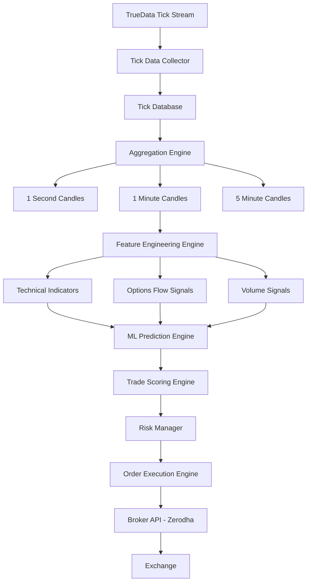

# 2. Data Pipeline Architecture

This diagram focuses only on **data ingestion and processing**.

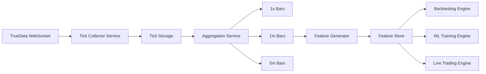

Purpose:

| Component | Role |
| --- | --- |
| Tick Collector | capture streaming ticks |
| Aggregation | generate multiple timeframes |
| Feature Generator | compute indicators |
| Feature Store | ML dataset |

# 3. Machine Learning Training Pipeline

This pipeline runs **offline**.

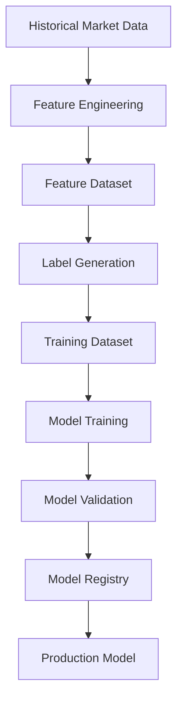

Training loop:

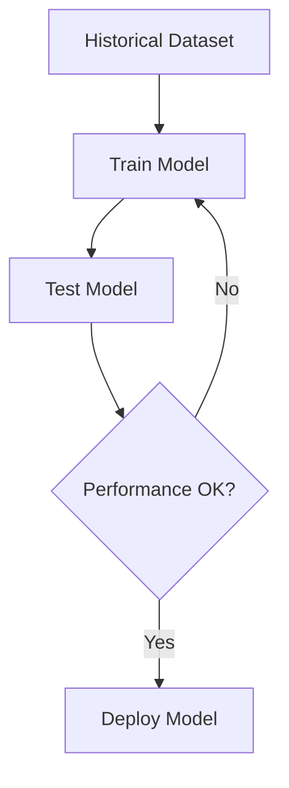

# 4. Live Trading Execution Pipeline

Real-time system.

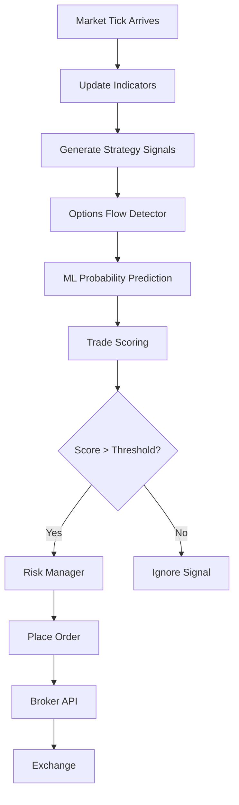

# 5. Decision Engine Logic

Signal scoring logic:

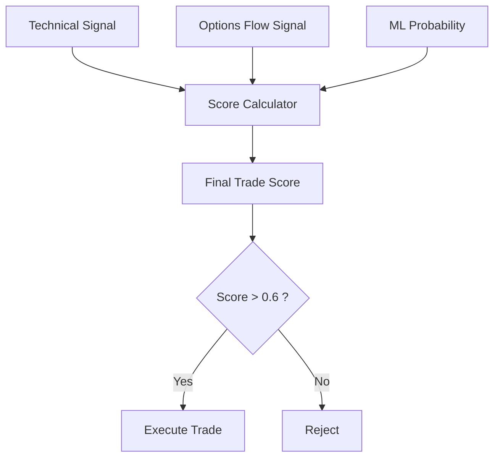

Score formula:

```
TradeScore =
0.5 * ML_Probability
+ 0.3 * OptionsFlowScore
+ 0.2 * TechnicalSignalStrength
```

---

# 6. Backtesting Architecture

Used to validate strategies.

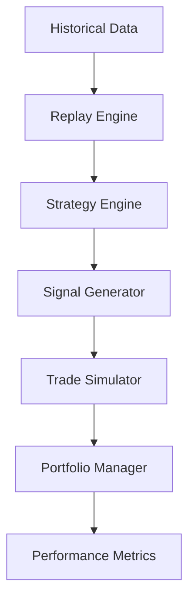

Metrics calculated:

```
Win rate
Profit factor
Sharpe ratio
Max drawdown
Expectancy
```

---

# 7. Low Level Architecture (LLD)

System components.

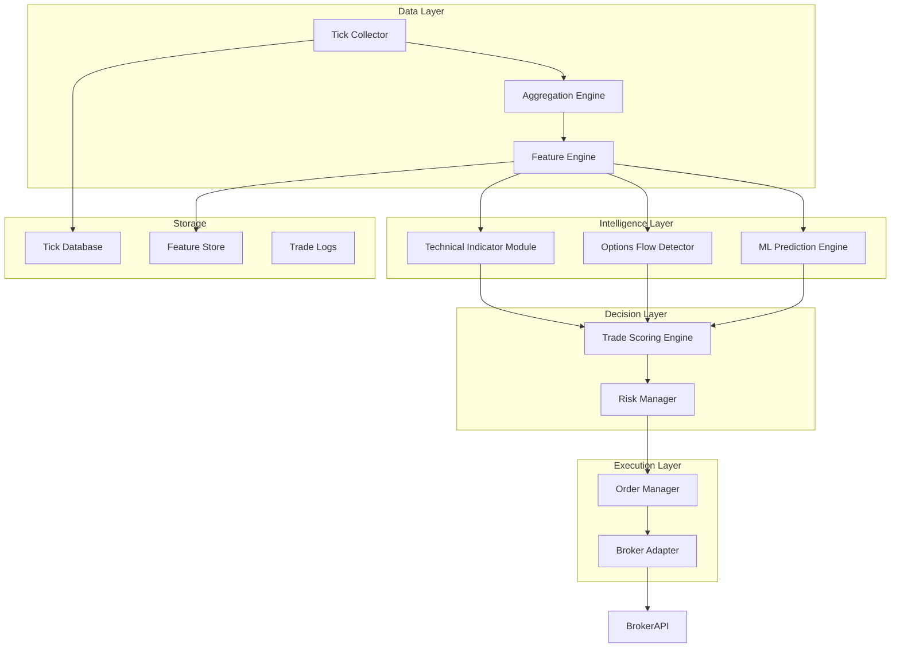

# 8. Service-Level Architecture

If you modularize the system:

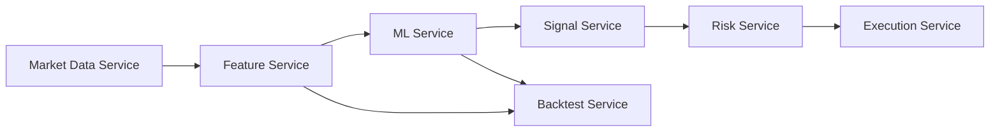

# 9. Database Schema Design

### Tick Data Table

```
tick_data

timestamp
symbol
price
volume
bid_price
ask_price
bid_qty
ask_qty
```

---

### Minute Candle Table

```
minute_candles

timestamp
symbol
open
high
low
close
volume
vwap
```

---

### Feature Table

```
features

timestamp
symbol
rsi
ema20
ema50
vwap_dist
volume_ratio
oi_change
pcr
atr
```

---

### Trade Log Table

```
trade_log

trade_id
timestamp
symbol
entry_price
exit_price
stop_loss
target
result
pnl
```

---

# 10. Project Folder Structure

```
ai_trading_system

data/
    tick_collector.py
    aggregation.py

features/
    indicators.py
    feature_engine.py

models/
    train_model.py
    predictor.py

strategy/
    signal_generator.py
    options_flow_detector.py

risk/
    risk_manager.py

execution/
    broker_adapter.py
    order_manager.py

backtest/
    backtest_engine.py

database/
    schema.sql

main.py
```

---

# 11. System Runtime Loop

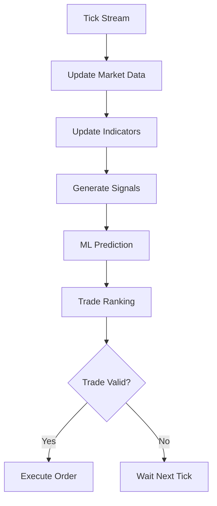

Loop interval:

```
30–60 seconds
```

---

# 12. Final System Overview

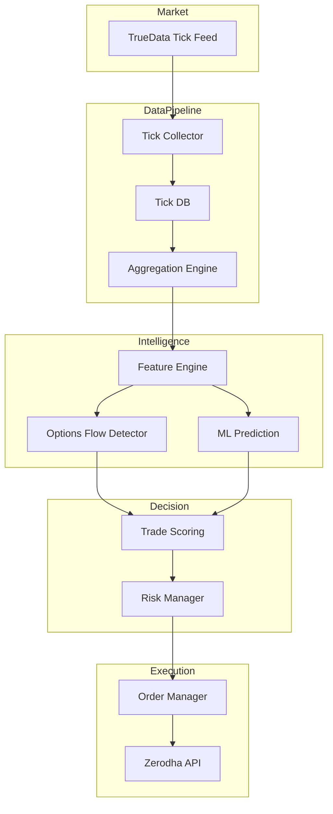

---

# 13. Final Concept

Your system ultimately becomes a **mini quant trading engine** with:

```
Market Data
+ Technical Signals
+ Options Flow Analysis
+ Machine Learning
+ Risk Control
+ Automated Execution
```

All running locally on your laptop.